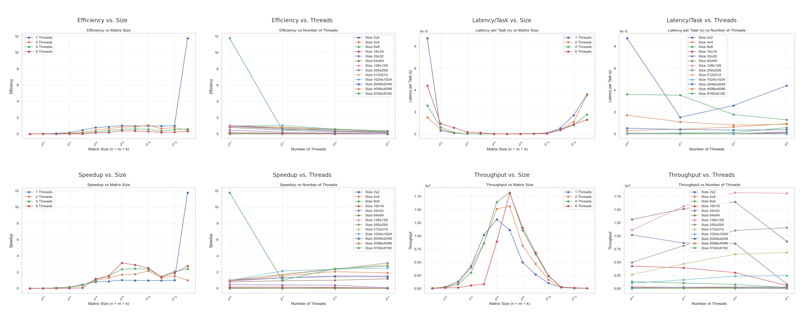

# Parallel Matrix Multiplication using HPX

## Description
This project implements **parallel matrix multiplication** using **HPX**, an **asynchronous many-task runtime**.  
The code utilizes **HPX parallel algorithms** to distribute computation efficiently across multiple cores.

### **Features**
- Uses **HPX experimental for loop and parallel execution policies** (` hpx::experimental::for_loop`) (`hpx::execution::par`)
- Implements **asynchronous execution** with `hpx::future<T>`.
- Dynamically generates random matrices.
- Accepts **custom matrix sizes** via command-line arguments.
- Outputs execution time for benchmarking along with speedup, throughput, efficiency and latency
---

## **Build & Run Instructions**
### **Dependencies**
- **HPX (C++ parallel runtime)**
- **CMake (Build system)**
- **vcpkg (for dependency management, optional)**

### **Installation**
- Install HPX using a package manager
- Clone the repository
- Build the project using CMake
- Run the program with the following command
  
  `./parallel_matrix_multi --n 3 --m 2 --k 2 --s 1000 --l 0 --u 10000`
- Also generate benchmarks by running `/benchmarks/run_benchmarks.sh` using the following command
```
chmod +x run_benchmarks.sh
./run_benchmarks.sh  
```

### **Sample Output**
```
First Matrix:
3735 2852 5058 
3689 7477 766 

Second Matrix:
4368 7741 
6128 1654 
6509 9309 

Product Matrix:
66714058 80714765 
66918502 48054201 

Time taken: 0.000210541 sec
Speedup: 0.00316803
Number of threads: 8
Efficiency: 0.0396004%
Throughput: 18998.7
Latency per task: 5.26353e-05
```

### **Benchmark Results**

- Asynchronous strategy works well, especially for medium to large matrix sizes (512×512 to 1024×1024).
- Best performance is seen around 4/8 threads, where speedup and efficiency are balanced. 
- For very large matrices (2048×2048), might be hitting memory bandwidth or cache limitations.
- Small matrices don’t benefit much.

### **Implementation Details**
- Used a generic template named `parallel_matrix<T>` to accommodate all data types without any runtime overhead. Implemented the multiplication 'operator' function for the same.
- The multiplication is implemented using the basic `hpx::experimental::for_loop` with wrapped in a `hpx::async` task. All race conditions were considered and solved.
- All matrices were built randomly using the popular `std::default_random_engine`
- Different benchmarks are calculated to test the result against the basic `O(n^3)` solution.
- Python script plots graph for above benchmarks over different sizes and threads.